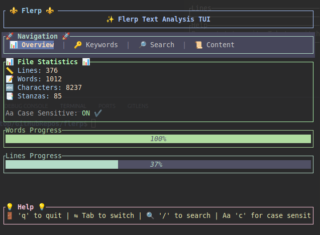

# 🔍 Flerp - Beautiful TUI Text Analysis Tool

A powerful terminal-based text analysis tool with an interactive user interface built with Rust and Ratatui.

## ✨ Features

- 📚 **PDF Analysis**: Also that TUI can use for pdf files
- 📊 **File Statistics**: Lines, words, characters, and stanzas count
- 🔤 **Keyword Extraction**: Find the most frequently used words
- 🔍 **Interactive Search**: Real-time search with highlighting
- 📄 **Content Preview**: View file content directly in the terminal
- 🎨 **Beautiful Interface**: Colorful and intuitive TUI with tabs and navigation
- ⚡ **Fast & Lightweight**: Built with Rust for optimal performance

## 🚀 Installation

### From crates.io (Recommended)

```bash
cargo install flerp
```

### From Source

```bash
git clone https://github.com/yourusername/flerp
cd flerp
cargo install --path .
```

## 📖 Usage

### Basic Usage

```bash
# Analyze a text file
flerp example.txt
```

```bash
# Version control
flerp --version
```

```bash
# Help and options
flerp --help
```

```bash
# Analyze a PDF file
flerp example.pdf
```

### Navigation Controls

- **Tab** - Switch between tabs
- **/** - Enter search mode
- **Enter** - Confirm search
- **Esc** - Exit search mode or quit application
- **q** - Quit application
- **c** - Toggle case sensitivity
- **↑/↓** - Navigate search results

## 🖥️ Interface

Flerp provides four main tabs:

1. **📊 Overview** - File statistics and visual progress bars
2. **🔤 Keywords** - Most frequently used words
3. **🔍 Search** - Interactive search with results
4. **📄 Content** - File content preview

## 🛠️ Development

### Prerequisites

- Rust 1.70.0 or later
- Cargo

### Building

```bash
git clone https://github.com/yourusername/flerp
cd flerp
cargo build --release
```

### Testing

```bash
cargo test
```

## 📦 Dependencies

- `ratatui` - Terminal UI library
- `crossterm` - Cross-platform terminal manipulation
- `clap` - Command line argument parsing

## 🤝 Contributing

Contributions are welcome! Please feel free to submit a Pull Request.

1. Fork the project
2. Create your feature branch (`git checkout -b feature/AmazingFeature`)
3. Commit your changes (`git commit -m 'Add some AmazingFeature'`)
4. Push to the branch (`git push origin feature/AmazingFeature`)
5. Open a Pull Request

## 📄 License

This project is licensed under the MIT OR Apache-2.0 License - see the [LICENSE](LICENSE) file for details.

## 🙏 Acknowledgments

- Built with [Ratatui](https://github.com/ratatui-org/ratatui)
- Inspired by modern terminal applications
- Thanks to the Rust community

## 📸 Screenshots



Made with ❤️ and Rust

Happy flerping 🎉
