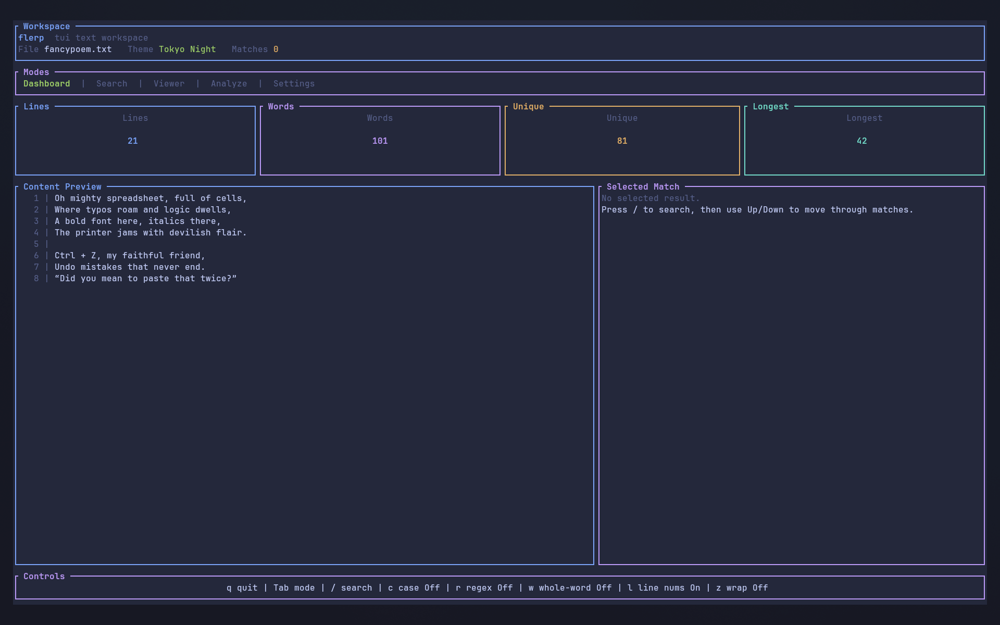
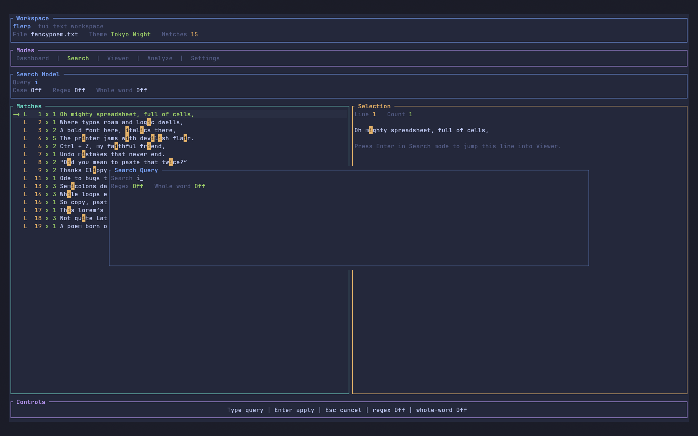

# Flerp

`flerp` is a terminal UI for exploring and analyzing local files without leaving the command line. It opens text documents in a full-screen `ratatui` workspace and gives you live search, content viewing, file statistics, keyword extraction, repeated-line detection, and adjustable display settings.

It is built in Rust and currently supports plain text files, PDFs, and image metadata previews.

## What Flerp Does

- Opens a file in an interactive terminal workspace
- Extracts text from PDF files for the same analysis flow used for text files
- Shows quick structural metrics such as line count, word count, unique words, empty lines, and longest line
- Finds the most frequent keywords in the loaded content
- Searches file content with live updates
- Supports case-sensitive, regex, and whole-word search modes
- Lets you jump from search results directly into the viewer
- Highlights repeated lines that appear multiple times
- Persists UI preferences in an XDG config file
- Includes multiple built-in color themes

## Supported File Types

- `.txt` and other UTF-8 readable text files
- `.pdf` via text extraction
- `.png`, `.jpg`, `.jpeg` as metadata summaries

For image files, `flerp` does not render the image in the terminal. It shows file metadata such as name, format, dimensions, and file size instead.

## Interface Overview

The application is organized into five modes:

1. `Dashboard`
   Quick summary cards, content preview, and the currently selected search match.
2. `Search`
   Search results, search options, and regex validation errors.
3. `Viewer`
   Scrollable file content view.
4. `Analyze`
   Extended analysis panels such as keywords and repeated lines.
5. `Settings`
   Theme and behavior settings that are saved automatically.

## Features

### Search

- Live search while typing
- Case-sensitive toggle
- Regex search toggle
- Whole-word matching toggle
- Match counts per result
- Jump-to-line from the selected result

### Analysis

- Lines
- Words
- Characters
- Stanzas
- Empty lines
- Unique words
- Longest line
- Average word length
- Top keywords
- Repeated lines

### UI and Workflow

- Full-screen terminal interface
- Multiple themes
- Optional line numbers
- Optional line wrapping
- Adjustable content preview size
- Adjustable keyword count
- Saved preferences between runs

## Installation

### From crates.io

```bash
cargo install flerp
```

### From source

```bash
git clone https://github.com/Huseynteymurzade28/flerp
cd flerp
cargo install --path .
```

## Running

### Open a file

```bash
flerp path/to/file.txt
```

### Open a PDF

```bash
flerp path/to/document.pdf
```

### Open an image metadata view

```bash
flerp path/to/image.png
```

### Show help

```bash
flerp --help
```

### Show version

```bash
flerp --version
```

## Terminal Requirement

`flerp` requires an interactive terminal session. It will exit with an error if stdin or stdout is not connected to a real terminal.

## Keyboard Controls

### Global

- `q` quit the application
- `Esc` exit search mode or quit when not searching
- `Tab` switch between modes
- `/` enter search mode

### Search and Filters

- `Enter` apply the current search or jump to the selected result from the Search tab
- `Backspace` delete the last search character
- `c` toggle case-sensitive search
- `r` toggle regex mode
- `w` toggle whole-word matching

### Viewer

- `Up` scroll up
- `Down` scroll down
- `PageUp` scroll up by one preview window
- `PageDown` scroll down by one preview window
- `Home` jump to the top
- `End` jump to the bottom

### Search Results and Settings

- `Up` and `Down` move through search results
- `Left` and `Right` adjust the selected setting in the Settings tab

### Display Options

- `l` toggle line numbers
- `z` toggle line wrapping

## Saved Settings

Flerp stores UI preferences in the XDG config directory using `directories::ProjectDirs`.

Typical Linux path:

```text
~/.config/flerp/settings.toml
```

Saved settings include:

- theme
- keyword limit
- preview line count
- case sensitivity
- regex mode
- whole-word mode
- line numbers
- line wrapping

## Development

### Prerequisites

- Rust toolchain
- Cargo

### Build

```bash
cargo build --release
```

### Test

```bash
cargo test
```

### Run from source

```bash
cargo run -- path/to/file.txt
```

## Tech Stack

- `ratatui` for the terminal UI
- `crossterm` for terminal input/output
- `clap` for CLI argument parsing
- `pdf-extract` for PDF text extraction
- `regex` for advanced searching
- `serde` and `toml` for persisted settings
- `directories` for config directory resolution
- `image` for image metadata support

## Screenshots




## Repository

- Homepage: <https://github.com/Huseynteymurzade28/flerp>
- Repository: <https://github.com/Huseynteymurzade28/flerp>

## License

MIT
