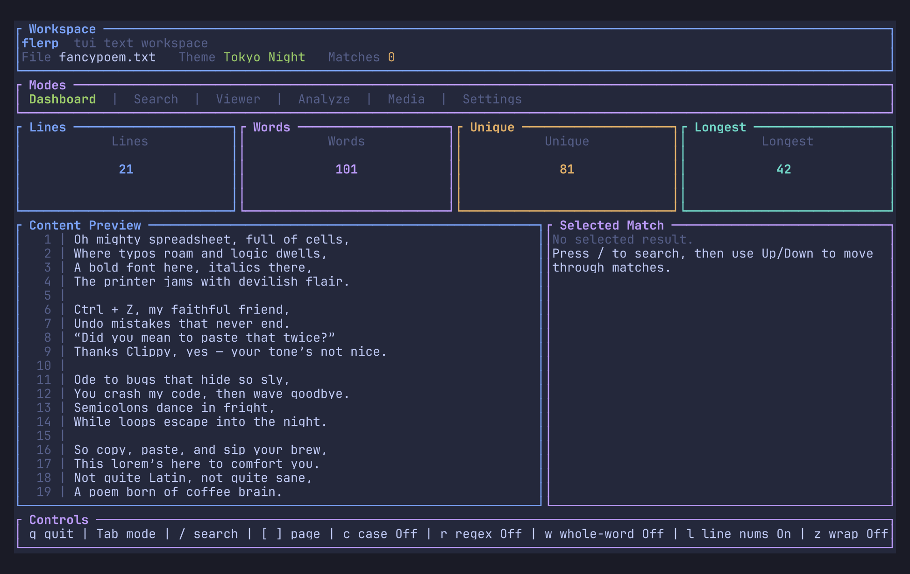
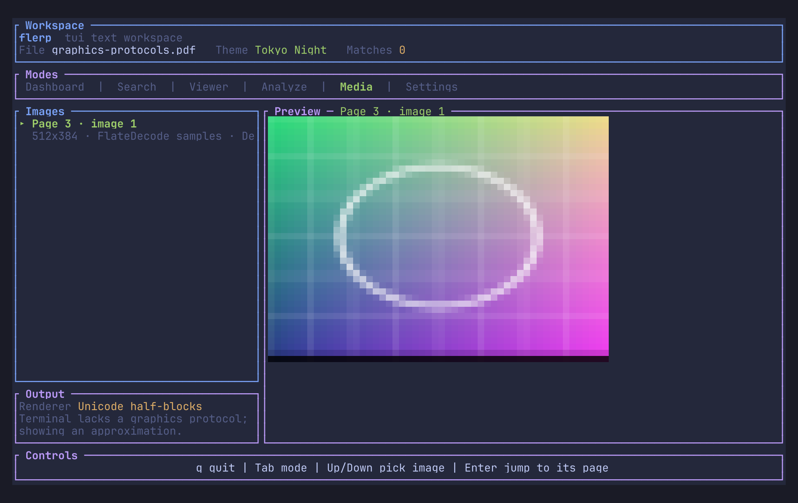
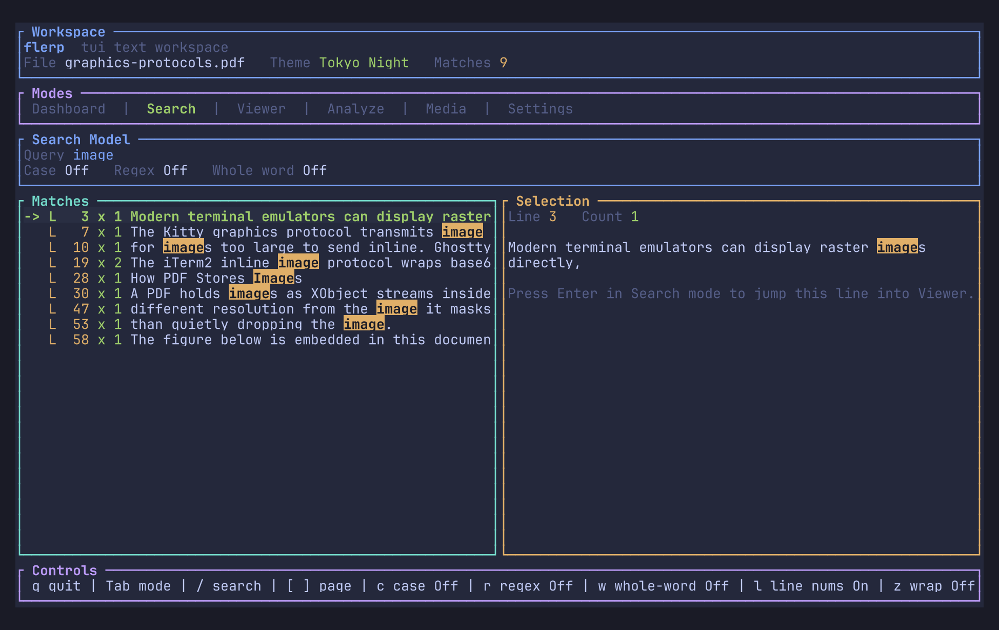
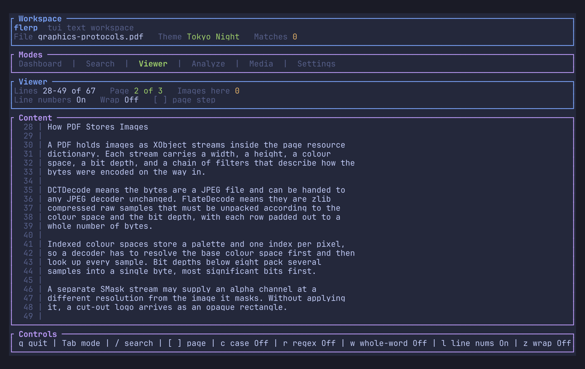
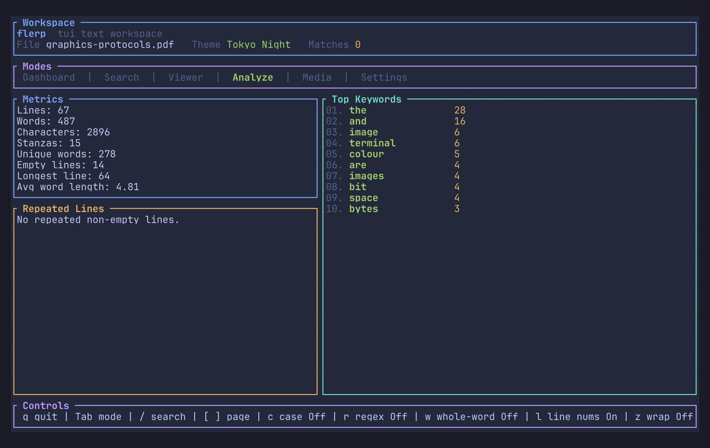
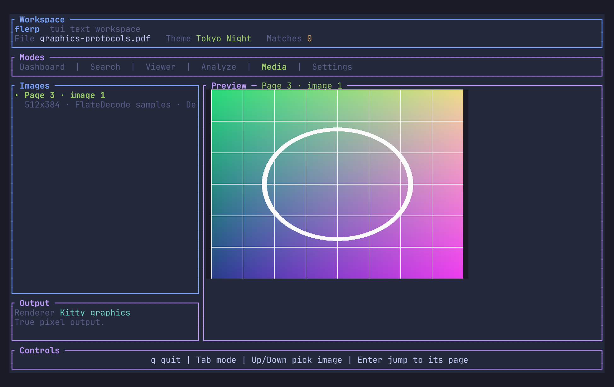
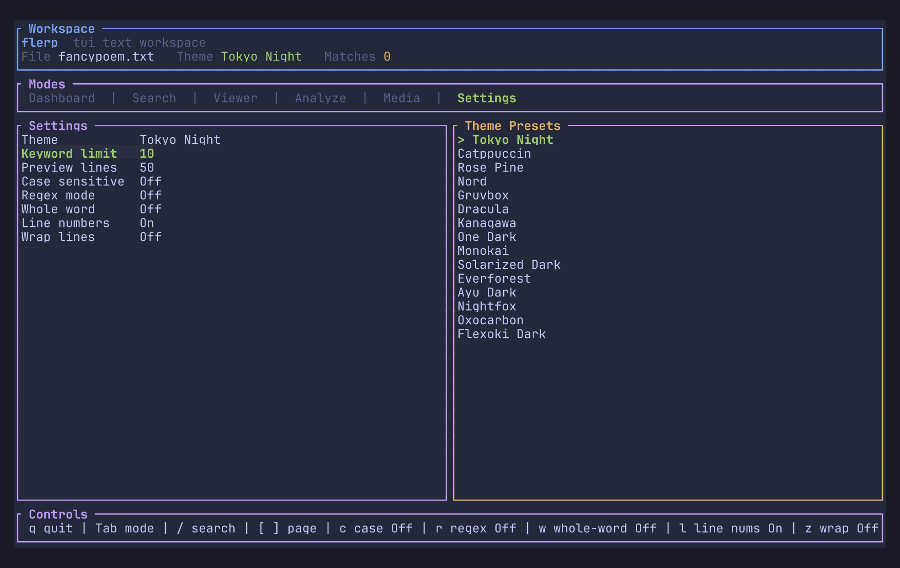

# Flerp

`flerp` is a terminal UI for exploring and analyzing local files without leaving the command line. It opens text documents in a full-screen `ratatui` workspace and gives you live search, content viewing, file statistics, keyword extraction, repeated-line detection, and adjustable display settings.

It is built in Rust and currently supports plain text files, PDFs, and images. PDFs are read in full — every page of text plus the raster images embedded in them, rendered as real pixels in terminals that support a graphics protocol.



## What Flerp Does

- Opens a file in an interactive terminal workspace
- Reads every page of a PDF and tracks where each page starts
- Extracts the images embedded in a PDF and displays them as real pixels
- Renders `.png` and `.jpg` files in the terminal
- Shows quick structural metrics such as line count, word count, unique words, empty lines, and longest line
- Finds the most frequent keywords in the loaded content
- Searches file content with live updates
- Supports case-sensitive, regex, and whole-word search modes
- Lets you jump from search results directly into the viewer
- Highlights repeated lines that appear multiple times
- Persists UI preferences in an XDG config file
- Includes multiple built-in color themes

## Supported File Types

- `.txt` and other UTF-8 readable text files
- `.pdf`, including page structure and embedded raster images
- `.png`, `.jpg`, `.jpeg`, rendered in the terminal

## Image Rendering

`flerp` draws images with the terminal's own graphics protocol, so what you see
is the image itself rather than character art. It picks the best available of:

| Protocol | Terminals |
| --- | --- |
| Kitty graphics | kitty, Ghostty, WezTerm, Konsole |
| Sixel | foot, xterm, WezTerm, Contour, Windows Terminal |
| iTerm2 inline | iTerm2 |

When none of these is available, `flerp` falls back to Unicode half-blocks and
says so in the `Media` mode, so it is always clear whether you are looking at
true pixels or an approximation. Pass `--graphics kitty` (or `sixel`, `iterm2`,
`halfblocks`) to override detection, which is useful under multiplexers that
swallow the capability query.



Above is the fallback; the `Media` section below shows the same image over a
real graphics protocol.

Images are lifted straight out of the PDF's own data. `DCTDecode` (JPEG) and
Flate/LZW-compressed raster data are supported across grayscale, RGB, CMYK,
indexed-palette and 1-bit sources, and `/SMask` transparency is applied so
cut-out logos do not arrive as opaque boxes. `JPXDecode` (JPEG 2000), CCITT fax
and JBIG2 images are listed with the reason they were skipped rather than
silently dropped.

## Interface Overview

The application is organized into various modes, reached with `Tab`.

### Dashboard

Quick summary cards, a content preview, and the currently selected search match.
Shown at the top of this page.

### Search

Search results, search options, and regex validation errors. Matches are
highlighted in place and counted per line.



### Viewer

Scrollable file content. For PDFs it also reports the current page, the total
page count, and how many images sit on the page you are reading.



### Analyze

Extended analysis panels such as top keywords and repeated lines.



### Media

Images found in the file, the renderer in use, and anything that could not be
decoded.



### Settings

Theme and behavior settings, saved automatically as you change them.



## Features

### Search

- Live search while typing
- Case-sensitive toggle
- Regex search toggle
- Whole-word matching toggle
- Match counts per result
- Jump-to-line from the selected result

### Analysis

- Lines
- Words
- Characters
- Stanzas
- Empty lines
- Unique words
- Longest line
- Average word length
- Top keywords
- Repeated lines

### Paged Documents

- Page count and current page shown while scrolling
- `[` and `]` step a whole page at a time
- Search results report the page a match landed on
- Per-page image counts

### UI and Workflow

- Full-screen terminal interface
- Viewer fills the available height, and `PageUp`/`PageDown` move by one screenful
- Multiple themes
- Optional line numbers
- Optional line wrapping
- Adjustable content preview size
- Adjustable keyword count
- Saved preferences between runs

## Installation

### From AUR

```bash
yay -S flerp
```

or the latest development version built from the `master` branch:

```bash
yay -S flerp-git
```

### From crates.io

```bash
cargo install flerp
```

### From source

```bash
git clone https://github.com/Huseynteymurzade28/flerp
cd flerp
cargo install --path .
```

## Running

### Open a file

```bash
flerp path/to/file.txt
```

### Open a PDF

```bash
flerp path/to/document.pdf
```

### Open an image

```bash
flerp path/to/image.png
```

### Force a graphics protocol

Detection is automatic, but a multiplexer or SSH session can swallow the
capability query. Say what your terminal supports instead:

```bash
flerp --graphics kitty path/to/document.pdf
```

Accepts `auto` (the default), `kitty`, `sixel`, `iterm2` and `halfblocks`.

### Start somewhere other than the top

```bash
flerp --page 12 report.pdf          # open the viewer on page 12
flerp --search "invoice" report.pdf # open with the search already applied
```

### Show help

```bash
flerp --help
```

### Show version

```bash
flerp --version
```

## Headless Mode

Everything `flerp` works out about a file can be written to stdout or to disk
instead of drawn in a terminal, so it composes with the rest of your shell.
Passing any of `--json`, `--text` or `--extract-images` skips the TUI entirely.

### Analysis as JSON

```bash
flerp --json report.pdf
```

One object on stdout: structural stats, keywords, repeated lines, the page
table, every embedded image with its dimensions, and any images that could not
be decoded along with the reason.

```bash
flerp --json report.pdf | jq '.pages | length'
flerp --json report.pdf | jq -r '.keywords[] | "\(.count)\t\(.word)"'
```

### Plain text

```bash
flerp --text report.pdf > report.txt
```

Writes the extracted text verbatim — every page of a PDF, in page order.
Closing the pipe early (`| head`) is treated as the reader having had enough,
not as an error.

### Extracting embedded images

```bash
flerp --extract-images ./out report.pdf
```

Writes each embedded image as PNG into `./out`, named `page-003-img-02.png` so
the files sort into reading order. PNG keeps the alpha that `/SMask`
transparency produces. Combine with `--json` and the written paths are reported
inside the JSON object rather than beside it, so stdout stays parseable.

### Searching without the TUI

```bash
flerp --search "revenue" --json report.pdf   # matches with page numbers
flerp --search "revenue" --text report.pdf   # no: --text and --json conflict
flerp --search "revenue" --extract-images ./out report.pdf
```

With `--json`, matches carry their line number, page number and per-line match
count. Without it, matches print grep-style as `file:line:text`. The search
modifiers work headlessly too: `-i` ignore case, `-e` regex, `-w` whole word.
Unlike the TUI, headless search never reads your saved settings, so a script
gets the same result on any machine.

## Terminal Requirement

The TUI requires an interactive terminal session and will exit with an error if
stdin or stdout is not connected to a real terminal. Headless mode has no such
requirement — that is the point of it.

## Keyboard Controls

The footer always shows the keys for whatever mode you are in, dropping the
less important ones when the terminal is too narrow to hold them all.

### Global

- `q` or `Ctrl-c` quit the application
- `Esc` cancel the open prompt, or quit when no prompt is open
- `Tab` next mode, `Shift-Tab` previous mode
- `/` open the search prompt
- `:` open the go-to-line prompt; digits only, `Enter` jumps

### Search and Filters

- `Enter` apply the current search or jump to the selected result from the Search tab
- `Backspace` delete the last search character
- `n` next match, `N` previous match — both follow the match into the viewer and
  wrap around at the ends
- `c` toggle case-sensitive search
- `r` toggle regex mode
- `w` toggle whole-word matching

### Viewer and Dashboard Preview

Both read the same scroll offset, so these work in either mode.

- `j` / `Down` scroll down, `k` / `Up` scroll up
- `Ctrl-d` and `Ctrl-u` move by half a screen
- `Ctrl-f` / `PageDown` and `Ctrl-b` / `PageUp` move by a whole screen
- `g` / `Home` jump to the top, `G` / `End` jump to the bottom
- `[` previous page, `]` next page (paged documents)

`h` and `l` are not bound to left and right: `l` toggles line numbers, and half
of a symmetric pair would be worse than neither.

### Media

- `j` / `k` (or `Up` / `Down`) move through the images in the file
- `Enter` jump the viewer to the page the selected image sits on

### Search Results and Settings

- `j` / `k` (or `Up` / `Down`) move through search results and settings rows
- `Left` and `Right` adjust the selected setting in the Settings tab

### Display Options

- `l` toggle line numbers
- `z` toggle line wrapping

## Mouse

- **Wheel** scrolls whatever is under the pointer: the file content, the match
  list, the image list or the settings rows
- **Click a mode** in the tab strip to switch to it
- **Click a row** in the match list, image list or settings list to select it
- Clicks are ignored while a prompt is open, since the prompt covers the panes
  behind it

## Scroll Position

The Viewer draws a scrollbar on the right edge of the content pane, with every
search match marked on its track. On a long document that turns "where are my
matches" from a scrolling exercise into a glance. Marks never paint over the
thumb, so where you are looking stays visible, and a file that already fits on
screen gets no scrollbar at all.

## Screenshots

Every screenshot in this file is generated from flerp's own render buffer, so
what you see is the interface as the program draws it.

## Saved Settings

Flerp stores UI preferences in the XDG config directory using `directories::ProjectDirs`.

Typical Linux path:

```text
~/.config/flerp/settings.toml
```

Saved settings include:

- theme
- keyword limit
- preview line count
- case sensitivity
- regex mode
- whole-word mode
- line numbers
- line wrapping

## Development

### Prerequisites

- Rust toolchain
- Cargo

### Build

```bash
cargo build --release
```

### Test

```bash
cargo test
```

### Run from source

```bash
cargo run -- path/to/file.txt
```

## Tech Stack

- `ratatui` for the terminal UI (TUI)
- `crossterm` for terminal input/output
- `clap` for CLI argument parsing
- `pdf-extract` for PDF text extraction
- `lopdf` for reading embedded PDF images
- `ratatui-image` for terminal graphics protocols
- `regex` for advanced searching
- `serde` and `toml` for persisted settings
- `directories` for config directory resolution
- `image` for decoding image data

## Repository

- Homepage: <https://github.com/Huseynteymurzade28/flerp>
- Repository: <https://github.com/Huseynteymurzade28/flerp>

## License

Released under the MIT License. See [LICENSE](LICENSE) for the full text.

Copyright (c) 2025-2026 Huseyn Teymurzade
